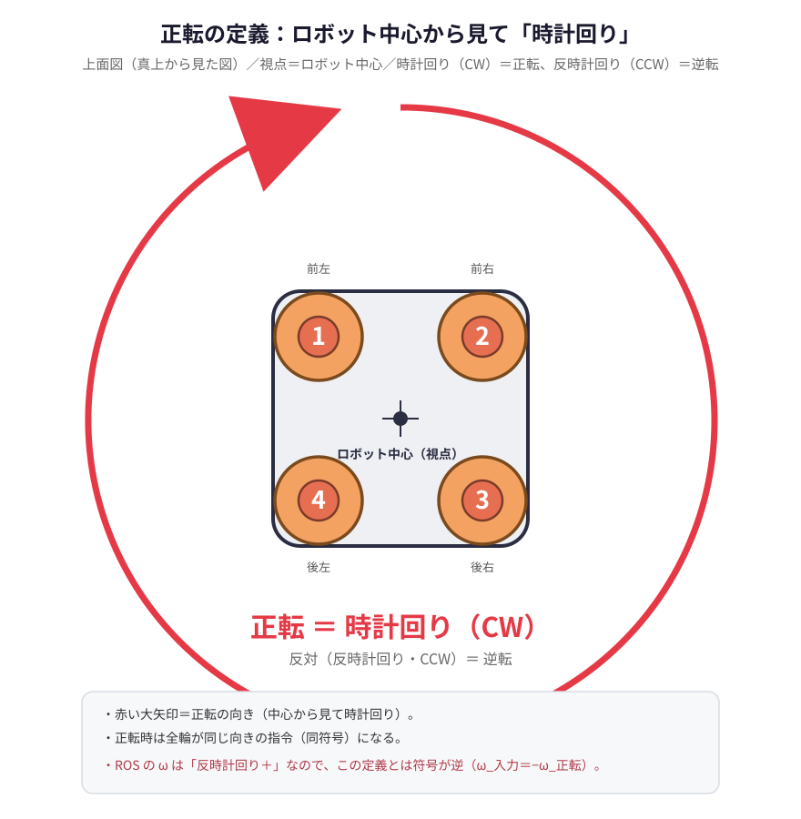
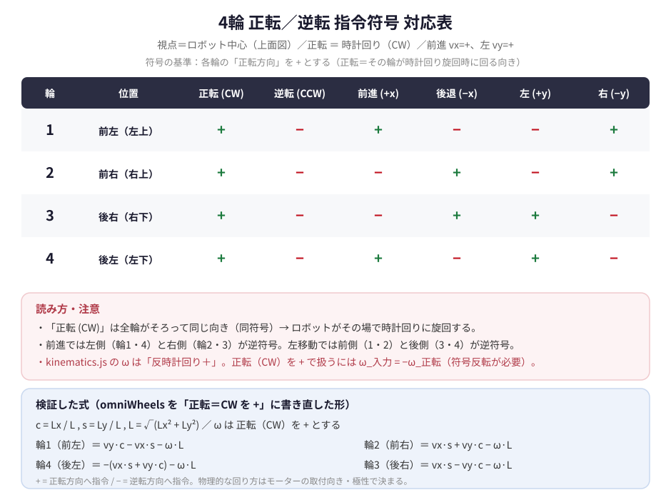

# 回転方向の定義と符号（RoboFieldKit）

## 結論

- **視点**：ロボットの中心（真上から見た上面図）
- **正転 ＝ 時計回り（CW）**
- **逆転 ＝ 反時計回り（CCW）**

---

## なぜ「視点」が必要か

回転方向は絶対値ではない。同じ回転でも、**どの面から見るか**で「左回り／右回り」が入れ替わる。

- 出力軸側（前面・負荷側）から見た向きと、端子側（背面）から見た向きは逆
- 真上から見た向きと、真下から見た向きも逆

そのため「どこから見て」を先に固定する。本プロジェクトは **視点＝ロボット中心（上面図）**。

---

## ROS／座標系との符号の違い（重要）

ROS は右手系（z 上向き）で、**上から見て反時計回りが ＋**。

| 本プロジェクト | kinematics.js の ω |
| --- | --- |
| 正転（CW） | **−** |
| 逆転（CCW） | **＋** |

→ `ω_code = −ω_正転`。`cmd_vel.angular.z` や逆運動学へ渡すときは **符号反転が必要**。

---

## 4輪 正転／逆転 指令符号 対応表

「正転方向を +」としたときの各輪の指令符号:

| 輪 | 位置 | 正転(CW) | 逆転(CCW) | 前進(+x) | 後退(−x) | 左(+y) | 右(−y) |
| --- | --- | --- | --- | --- | --- | --- | --- |
| 1 | 前左（左上） | + | − | + | − | − | + |
| 2 | 前右（右上） | + | − | − | + | − | + |
| 3 | 後右（右下） | + | − | − | + | + | − |
| 4 | 後左（左下） | + | − | + | − | + | − |

- **旋回**：全輪が同符号（正転なら全 +）
- **前進**：左側（1・4）と右側（2・3）が逆符号
- **左移動**：前側（1・2）と後側（3・4）が逆符号

---

## 検証（`kinematics.js` の `omniWheels`）

`Lx=0.10, Ly=0.15`（テスト既定値）で実行。**全項目 PASS**。

- 純旋回：4輪すべて同符号／CW は CCW の単純な符号反転
- 前進・左移動の符号関係：上表どおり
- 旋回項：全輪が `L = √(Lx²+Ly²)` で一致
- 最小二乗の往復（`BᵀB u = Bᵀw`）：誤差 `1.1e-16`（モデルは可逆）

### 観察（要確認）

`omniWheels` の並進ゲインは **vx が `Ly/L`、vy が `Lx/L`**。`Lx ≠ Ly` のとき前進と横移動でゲインが変わる。
45°固定マウントのオムニなら本来どちらも `1/√2 ≒ 0.707` になるはずなので、**ローラー角度（実機のマウント角）と要突き合わせ**。

---

## 実機との突き合わせ（保留）

コントローラ側の符号・進行方向と一致させるには、その機種の仕様が必要。今回は対象外（保留）。
